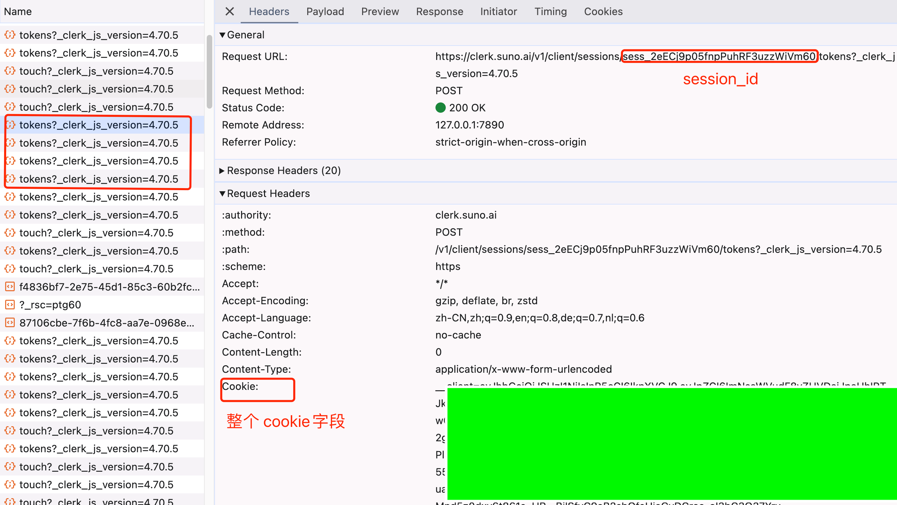
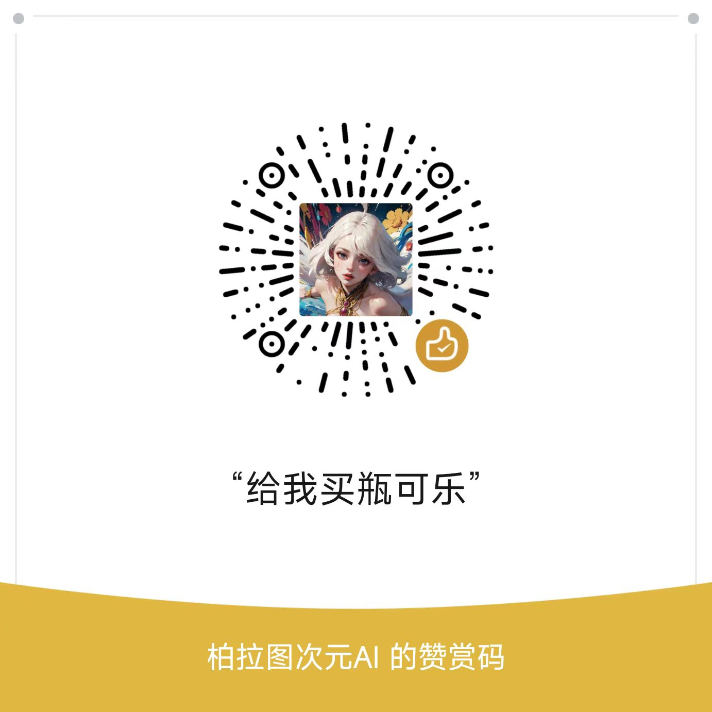

# Suno API
[中文](./README_ZH.md)

# Good news
I provide the Suno AI API, no deployment is required, no subscription to suno is required. Lower price, more convenient to use the suno API. 
No need to worry about watermarks and Captcha issues
#### Website: https://api.bltcy.ai


## Disclaimer
- This project is released on GitHub under the MIT license, free and open-source for educational purposes.

## Supported Features
- [x] Suno API supports Inspiration Mode, Custom Mode, and Continuation.
- [x] Provides standardized services compatible with OpenAI's interface format, supporting both streaming and non-streaming output.
- [x] Automatically maintains and keeps alive user account information once provided.
- [x] Persists task records, allowing recovery of tasks even after a program interruption.
- [x] Supports custom formatting of OpenAI Chat responses, based on Go Template syntax.
- [x] Compatible with front-end projects like chat-next-web.
- [x] Simplifies deployment process, supports docker-compose and docker.
- [x] Supput [New API](https://github.com/Calcium-Ion/new-api) [Docs](Suno.md)

## API Docs

http://localhost:8000/swagger/index.html

## Deployment

### Configuration
Initially obtain these from the browser; later stages will maintain automatic vitality.



### Env Environment Variables
| Environment Variable | Description                                           | Default Value |
| --- |-------------------------------------------------------| --- |
| SESSION_ID | Session ID from the image above                       | None |
| COOKIE | Cookie from the image above                           | None |
| BASE_URL | SUNO official API URL                                 | https://studio-api.suno.ai |
| PROXY | HTTP Proxy                                            | None |
| SECRET_TOKEN | Suno API seurity http header Bearer token             | None                                           |
| SQL_DSN | MySQL DSN, if empty, SQLite is used                   | None |
| PORT | Port to expose                                        | 8000 |
| ROTATE_LOGS | Whether to rotate logs daily                          | Yes |
| LOG_DIR | Path for log output                                   | ./logs |
| DEBUG | Whether to enable debug logs                          | No |
| PPROF | Enable Pprof for performance analysis, uses port 8005 | No |
| CHAT_OPENAI_BASE | OpenAI API endpoint                                   | https://api.openai.com |
| CHAT_OPENAI_KEY | OpenAI API key                                        | sk-xxxxx |
| CHAT_OPENAI_MODEL | Default model                                         | gpt-4o |
| CHAT_TIME_OUT | Chat request timeout                                  | 600 seconds |
| CHAT_TEMPLATE_DIR | Directory for chat templates                          | ./template |

### Docker Deployment
Step-by-step guide on how to run a Docker container with specific environment variables and port mappings. Sensitive details like SQL names, passwords, and IP addresses are replaced with placeholders for this guide.

```bash
# Deployment command using MySQL, modify the database connection parameters as needed.
docker run --name suno-api -d -p 8000:8000 \
-e SESSION_ID=xxxx \
-e COOKIE=xxxx  \
-e CHAT_OPENAI_BASE=https://api.openai.com  \
-e CHAT_OPENAI_KEY=sk-xxxxx  \
 sunoapigo/suno-api
```

docker-compose.yml
```bash
version: '3.2'

services:
  sunoapi:
    image: sunoapigo/suno-api:latest
    container_name: sunoapi
    restart: always
    ports:
      - "8000:8000"
    volumes:
      - ./logs:/logs
      - ./template:/template
    environment:
      - PORT=8000
      - SECRET_TOKEN=123456
      - SQL_DSN=root:123456@tcp(localhost:3306)/sunoapi
      - TZ=Asia/Shanghai
      - ROTATE_LOGS=false
      - PPROF=false
      - DEBUG=false
      - CHAT_TEMPLATE_DIR=./template
      - CHAT_OPENAI_MODEL=gpt-4o
      - CHAT_OPENAI_BASE=https://one-api.bltcy.top
      - CHAT_OPENAI_KEY=sk-
```

## Customizing OpenAI Chat Response Format
Edit the suno.yaml in ./template using Go template syntax.

- chat_stream_submit: Output format when a streaming task is successfully submitted.
- chat_stream_tick: Output format for each progress check during streaming.
- chat_resp: Output format upon completion of streaming.

## References
- Suno AI Official Website: https://suno.com
- Suno-API GitHub: https://github.com/SunoAI-API/Suno-API

## License
MIT © [Suno API](./license)

## Support


This project is open-source on GitHub under the MIT license and is free of charge. If you find this project helpful, please give it a star and share it. Thank you for your support!
